Florencia Oribe.

# Práctica 1:

## Práctica 1a: Instalación de un Proxmox


## Objetivo

El objetivo de esta práctica es instalar y configurar Proxmox VE en una máquina virtual creada con VirtualBox.

Durante la práctica configuraremos la red, comprobaremos la conectividad, actualizaremos el sistema e instalaremos el certificado de la autoridad certificadora (CA) de Proxmox en nuestro equipo Linux.

### 1. Creación de la máquina virtual

Descargamos la imagen ISO de Proxmox VE desde su página oficial y creamos una máquina virtual en VirtualBox con los recursos requeridos para la práctica.
- 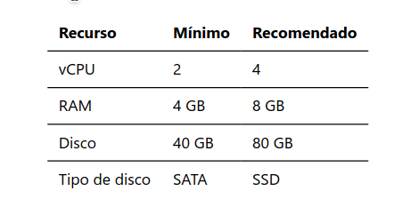

Configuramos el adaptador de red de la máquina virtual utilizando la red NAT solicitada.
La red NAT permite que la máquina virtual utilice la conexión del equipo anfitrión para comunicarse con otras redes.

- 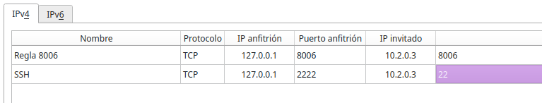


### 2. Proceso de Instalación
Durante el proceso configuramos los siguientes parámetros:
- **Hostname: proxmox.local**
- **Dirección IP: 10.0.2.3/24**
- **Puerta de enlace: 10.0.2.1**
- **DNS: 1.1.1.1**

*Dato importante: despues de configurar la instalación tenemos que quitar la iso de la vm porque si no, cada rato intentara leerla y no funcionara.*
Comprobamos el hostname, si la ip es correcta y la version de PROXMOX:
- 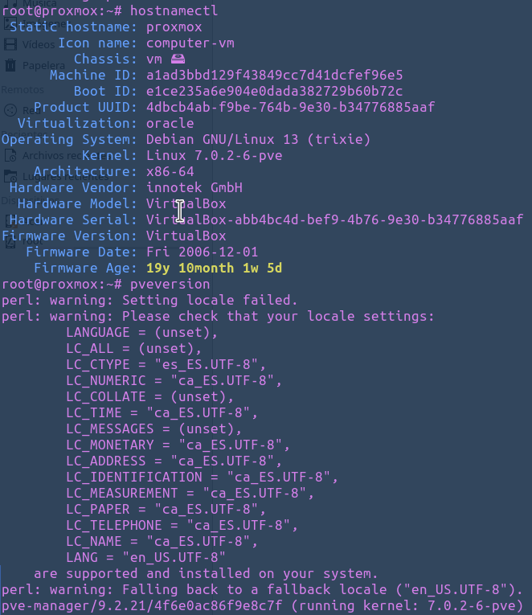
- 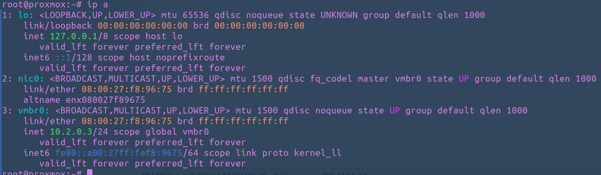

- Comprobamos si tenemos conexión via ssh.
- 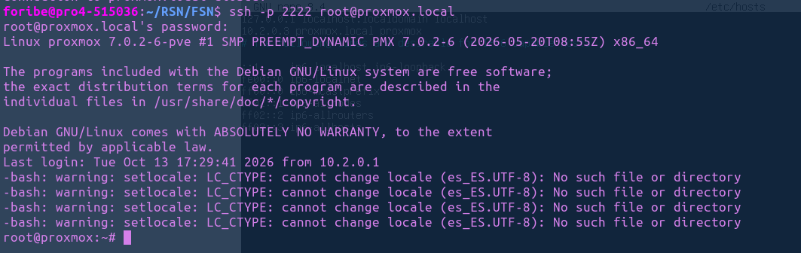


### 3. Acceso a la interfaz web

Proxmox dispone de una interfaz web de administración que utiliza el protocolo HTTPS y el puerto 8006.

Accedemos mediante la dirección:

*https://proxmox.local:8006*

Para que el acceso funcione, el nombre proxmox.local debe resolverse correctamente desde nuestro equipo y debe existir conectividad con el servidor.
- 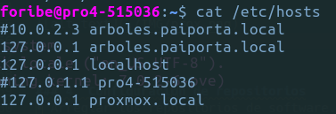

Desde la interfaz web podemos administrar el nodo, gestionar máquinas virtuales, configurar almacenamiento y consultar el estado del sistema.


- 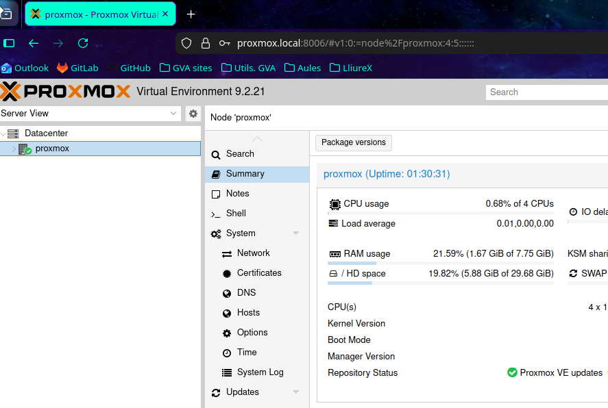


### 4. Configuración de repositorios

Para arreglar los repositorios tuveimos que deshabilitar (comentando) el pve-enterprise.sources y añadir **pve-no-subscription.sources**:
```bash 
Types: deb
URIs: http://download.proxmox.com/debian/pve
Suites: trixie
Components: pve-no-subscription
Signed-By: /usr/share/keyrings/proxmox-archive-keyring.gpg
```
Luego de esto, ya podemos actualizar el Proxmox.
- 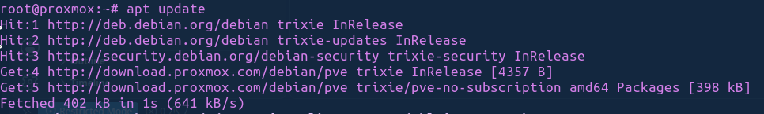
Comprobamos desde la interfaz web que no hay mas actualizaciones.
- 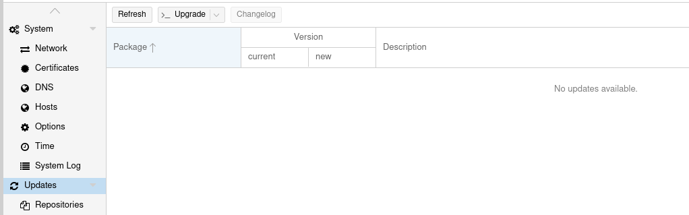


### 5. Instalación del certificado de la CA
Ejecutamos el siguiente comando para visualizar el certificado:

```bash
cat /etc/pve/pve-root-ca.pem
```
- 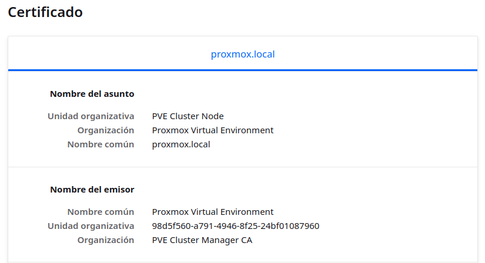
Copiamos todo el contenido que aparece y creamos un fichero de texto donde pegamos el contenido copiado.
Guardamos el archivo con el nombre:

**pve-root-ca.crt**

Para verificar que el certificado copiado es el mismo que tiene Proxmox, ejecutamos en el servidor:

```bash
openssl x509 -in /etc/pve/pve-root-ca.pem -noout -fingerprint -sha256
```

- 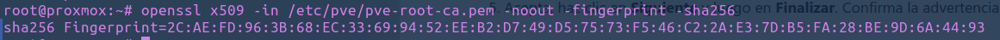

En nuestro equipo Linux, desde la carpeta donde hemos guardado el certificado, ejecutamos:

```bash
openssl x509 -in pve-root-ca.crt -noout -fingerprint -sha256
```
- 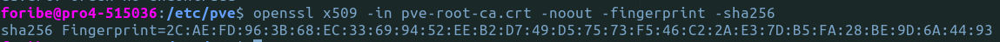


#### Importamos el certificado: 
Abrimos Firefox y accedemos a:

Ajustes → Privacidad y seguridad → Certificados → Ver certificados → Autoridades → Importar

Seleccionamos el archivo pve-root-ca.crt que hemos guardado anteriormente.

- 


### Conclusión

En esta práctica hemos realizado la instalación y configuración inicial de Proxmox VE en una máquina virtual utilizando VirtualBox.

Hemos configurado la red NAT, comprobado la conectividad mediante SSH, preparado los repositorios sin suscripción y actualizado el sistema.

Además, hemos obtenido el certificado de la autoridad certificadora de Proxmox, comprobado su huella SHA-256 e importado el certificado en Firefox.

Con estos pasos hemos preparado un entorno de virtualización para administrar máquinas virtuales y contenedores desde Proxmox.


# Práctica 1b - Redundancia y almacenamiento en PROXMOX

## ZFS con mirror
Creamos dos discos duros virtuales de 50GB.
- 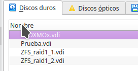

Creamos el mirror de zfs llamado *pve-storage*
```bash
zpool create -o ashift=12 pve-storage mirror /dev/sdb /dev/sdc
```

Comprobamos estado y capacidad:
- 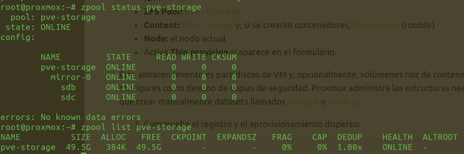

Creamos el pool desde la interfaz web con los siguientes datos:

```text
ID: zfs-lab
ZFS Pool: pve-storage
Content: Disk image y, si se crearán contenedores, Container (rootdir)
Node: el nodo actual
Activa Thin provision si aparece en el formulario
```

- 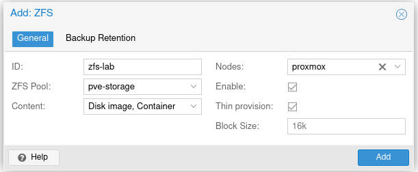


## RAID 1 con mdadm
1. Identificamos los dos discos de laboratorio:

```bash
lsblk -o NAME,SIZE,TYPE,FSTYPE,MOUNTPOINTS,MODEL
```

2. Creamos el array RAID 1 con los dispositivos de laboratorio correctos:
```bash
mdadm --create /dev/md0 --level=1 --raid-devices=2 /dev/sdb /dev/sdc
```
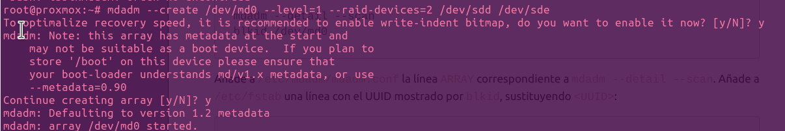


3. Comprobamos el estado:
```bash
mdadm --detail /dev/md0
cat /proc/mdstat
```
Que estado tiene el md0.

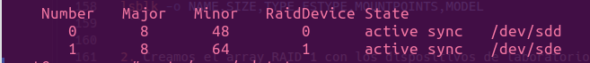


Hemos creado un array de disco y lo hemos registrado en proxmox. Para que cuando arranque lo idnentifique como arranque de disco..
Añadiendo el array 
ARRAY /dev/md0 metadata=1.2 UUID=5f70d22b:d6b111b6:7e758936:0305b089
al fichero /etc/mdadm/mdadm.conf

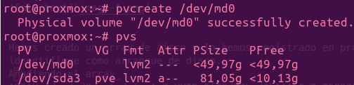

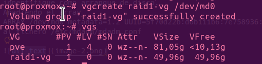


- 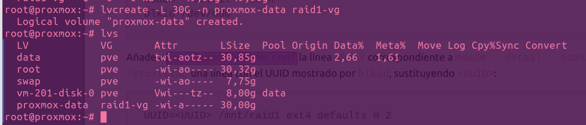

- 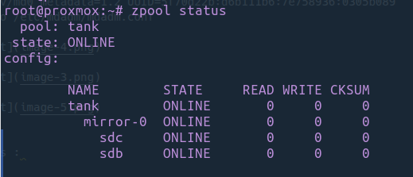
- 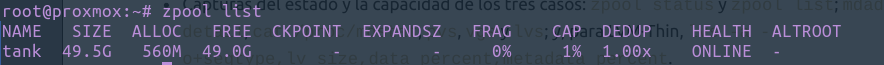
- 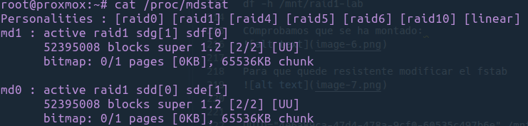

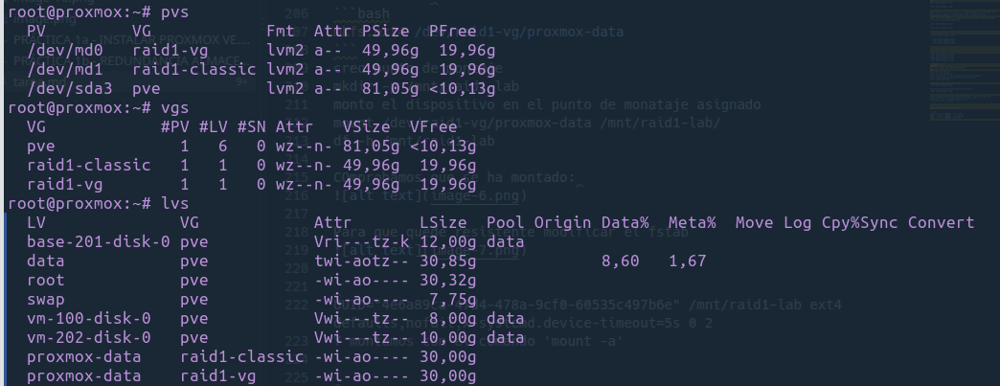


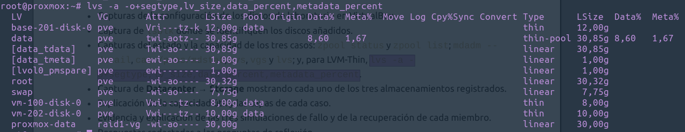

formatemos : 
```bash
mkfs.ext4 /dev/raid1-vg/proxmox-data
```
creo punto de montaje
mkdir -p /mnt/raid1-lab
monto el dispositivo en el punto de monataje asignado
mount /dev/raid1-vg/proxmox-data /mnt/raid1-lab/
df -h /mnt/raid1-lab

COmprobamos que se ha montado: 
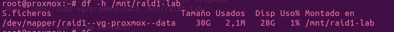

Para que quede resistente modificar el fstab
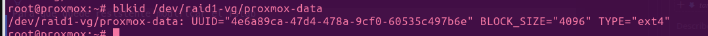


UUID="4e6a89ca-47d4-478a-9cf0-60535c497b6e" /mnt/raid1-lab ext4 defaults,nofail,x-systemd.device-timeout=5s 0 2
Y montamos con el comando 'mount -a'


4. Simulación de fallo de disco

```bash
mdadm --manage <ARRAY> --fail sdd
mdadm --manage <ARRAY> --remove sdd
mdadm --manage <ARRAY> --add sdd
```


Verifica que sigue activo en estado degradado:
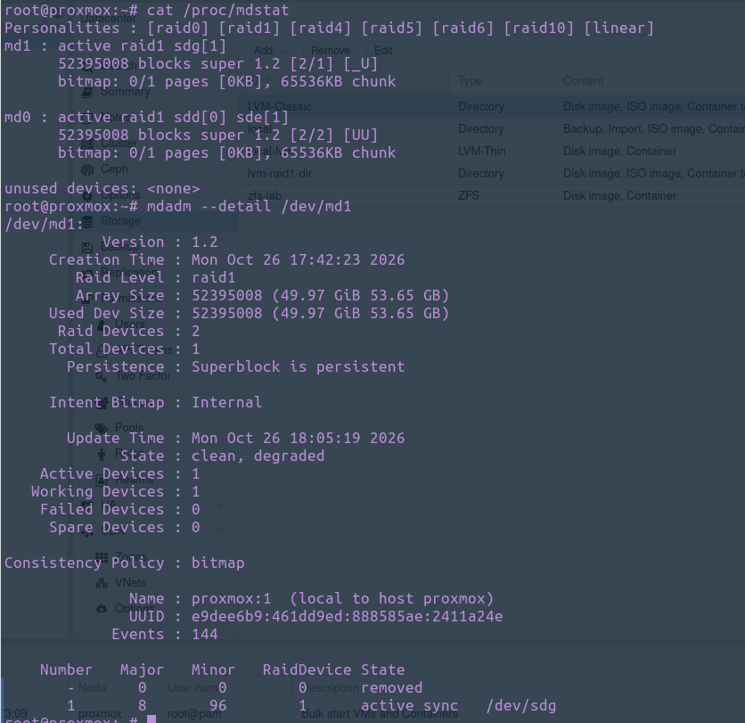

- Incoroportamos neuvamente el disco.
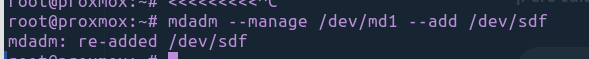


 Conclusión técnica
ZFS mirror y mdadm RAID1 mantienen el servicio ante la caída de un miembro, pero no sustituyen a las
copias de seguridad: fallos del sistema, corrupción o errores humanos aún pueden exigir una restauración.
Elige según la gestión, recuperación, snapshots y compatibilidad que necesite el escenario.
10. Reflexión y preguntas
Responde con tus propias palabras:
1. ¿Qué diferencia existe entre un volumen lógico y un sistema de archivos?
Un volumen lógico es el espacio que creamos con LVM, como si fuera un “disco virtual”. En cambio, el sistema de archivos es lo que ponemos encima, por ejemplo ext4, para poder guardar carpetas y archivos dentro

2. ¿Qué ventajas tiene RAID 1 frente a RAID 0?
La ventaja principal de RAID 1 es la redundancia. Los datos se copian en dos discos, así que si uno falla, el otro sigue funcionando. En RAID 0 no hay esa seguridad, porque si falla un disco se pierde todo.
3. ¿Por qué la redundancia no sustituye a las copias de seguridad?
Porque la redundancia solo protege frente al fallo de un disco, pero no frente a otros problemas, como borrar un archivo por error, corromper datos o sufrir un ataque. Para eso siguen haciendo falta copias de seguridad.

4. ¿Qué función tiene un zpool en ZFS?
El zpool es la base del almacenamiento en ZFS. Es el conjunto de discos que forma el pool y a partir de ahí luego ya se crean datasets o volúmenes.

5. ¿Qué diferencia existe entre un dataset y un zvol?
Un dataset se parece más a una carpeta o sistema de archivos dentro de ZFS, mientras que un zvol es como un disco de bloques, pensado por ejemplo para usarlo como disco de una máquina virtual.
6. ¿Qué es un mirror y qué fallo puede tolerar el mirror de dos discos de esta práctica?
Un mirror es una copia exacta de los datos en dos discos. En esta práctica, al ser un mirror de dos discos, puede fallar uno de ellos y el sistema sigue funcionando con el otro.
7. ¿Qué diferencia hay entre LVM-Thin y ZFS a la hora de almacenar discos de VM?
Los dos sirven para almacenar discos de máquinas virtuales, pero ZFS ya integra muchas más funciones, como compresión, snapshots y control de integridad. LVM-Thin es más simple y flexible, pero depende de otras capas para tener redundancia o más funcionalidades.
8. ¿Por qué LVM no aporta redundancia por sí solo?
Porque LVM solo organiza el almacenamiento, pero no replica los datos. Si queremos redundancia con LVM, tenemos que apoyarnos en algo más, como un RAID con mdadm.
9. ¿Qué diferencia existe entre el RAID gestionado por mdadm y un mirror ZFS?
Con mdadm el RAID se gestiona por una capa aparte, y luego encima montamos LVM o ext4. En ZFS todo está más integrado, porque el mirror y la gestión del almacenamiento van juntos dentro del propio sistema ZFS.

10. ¿Qué información aporta el estado del array o del pool después de simular un fallo?
Nos permite ver si el sistema sigue funcionando, si el array o el pool está degradado, qué disco ha fallado y si luego la reconstrucción se hace correctamente al volver a añadirlo.

11. ¿Qué representa el disco virtual que ve la VM y qué capas puede crear dentro de él?
Para la VM ese disco es como si fuera un disco físico normal. Dentro de él puede crear particiones, sistemas de archivos, LVM e incluso su propia organización interna, igual que en una máquina real.

12. ¿Qué ventajas y riesgos tiene el aprovisionamiento thin? ¿Qué indican Data% y Meta%?
La ventaja del thin provisioning es que no hace falta reservar todo el espacio desde el principio, así que se aprovecha mejor el almacenamiento. El riesgo es que podemos asignar más espacio del que realmente tenemos y luego llenarlo.
Data% indica cuánto espacio de datos se está usando realmente, y Meta% cuánto ocupan los metadatos del thin pool.

13. ¿Qué capas comparten los casos 2 y 3, y en qué se diferencian a partir del VG?

He comprobado que la redundancia mejora mucho la disponibilidad, porque tanto con RAID 1 como con mirror ZFS el sistema sigue funcionando aunque falle un disco. También he visto que ZFS ofrece una gestión más integrada, mientras que con mdadm + LVM hay más capas y más pasos de configuración.

## Conclusión final
Después de hacer la práctica, diría que tanto mdadm + LVM como ZFS mirror sirven para montar almacenamiento redundante, pero ZFS me ha parecido más completo porque integra mejor todo.
Aun así, mdadm + LVM también funciona bien y permite entender mejor las capas del almacenamiento.
Lo más importante que saco de la práctica es que la redundancia ayuda a seguir trabajando cuando falla un disco, pero no sustituye a las copias de seguridad.

# PRÁCTICA 1C - COMPARACIÓN DE ALMACENAMIENTO CON LXC EN PROXMOX

## 1. Objetivos de la práctica

En esta práctica vamos a comparar el rendimiento de tres tipos de almacenamiento en Proxmox: **ZFS Mirror, LVM clásico con ext4 y LVM-Thin**.

Para ello, crearemos tres contenedores LXC y realizaremos pruebas de CPU, RAM y lectura y escritura para comprobar qué almacenamiento ofrece mejores resultados.

## 2. Creación de los contenedores LXC

Hemos creado tres contenedores utilizando la plantilla de Ubuntu 26.04 y la misma configuración en todos:

- **CPU:** 2 núcleos.
- **RAM:** 1024 MiB.
- **Swap:** 1024 MiB.
- **Disco:** 12 GiB.

La única diferencia es el almacenamiento donde se guarda el disco de cada contenedor.

| Contenedor | CTID | Almacenamiento |
|---|---|---|
| lxc-zfs | 101 | zfs-lab |
| lvm-raid1-dir | 102 | LVM-Classic |
| lvmthin-raid1 | 103 | LVM-THIN |

**Capturas que añadiría:**

- Configuración del CT 101, mostrando CPU, RAM y Root Disk en ZFS.
- Configuración del CT 102, mostrando CPU, RAM y Root Disk en LVM-Classic.
- Configuración del CT 103, mostrando CPU, RAM y Root Disk en LVM-THIN.

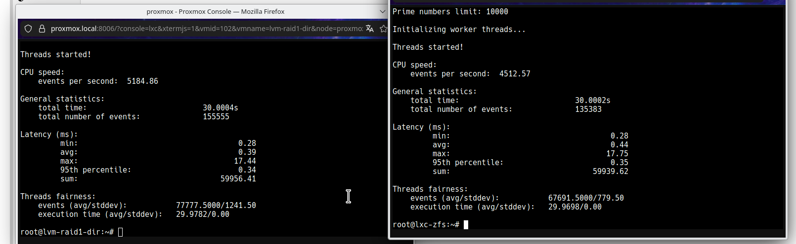

## 3. Prueba de rendimiento de CPU

Para medir el rendimiento de CPU, instalamos `sysbench` dentro de los contenedores:

```bash
apt update
apt install -y fio sysbench
```

Después ejecutamos el siguiente comando en cada contenedor, dejando únicamente uno encendido durante cada prueba:

```bash
sysbench cpu --threads=2 --time=30 run
```

Este comando realiza cálculos durante 30 segundos utilizando dos hilos. Nos permite comprobar cuántas operaciones por segundo consigue realizar cada contenedor.

### Resultados de CPU

| Backend | Eventos por segundo | Eventos totales | Uso de CPU |
|---|---:|---:|---|
| ZFS | 4512,57 | 135383 | 70-80 % |
| LVM clásico | 5184,86 | 155555 | 99 % |
| LVM-Thin | 6263,54 | 187915 | 99 % |

**Observaciones:**

LVM-Thin ha conseguido el mejor resultado con 6263,54 eventos por segundo, seguido de LVM clásico y ZFS.

Aunque los contenedores tienen la misma configuración, los resultados pueden variar según la carga que tenga el servidor en ese momento. Además, esta prueba mide principalmente la CPU, no la velocidad del almacenamiento.

**Capturas:** añadir aquí los resultados de `sysbench` de los tres contenedores.

## 4. Medición de RAM

Para comprobar el consumo de memoria, dejamos cada contenedor encendido y en reposo durante unos minutos.

Después consultamos el apartado **Summary** del contenedor y del nodo Proxmox para observar la RAM utilizada.

### Resultados de RAM

| Medición | ZFS | LVM clásico | LVM-Thin |
|---|---:|---:|---:|
| RAM asignada (MiB) | 1024 | 1024 | 1024 |
| RAM del CT en reposo (MiB) | ≈ 40 | ≈ 66 | ≈ 56 |
| RAM del nodo en reposo (MiB) | ≈ 2355 | ≈ 2355 | ≈ 2458 |

*Los valores son aproximados, ya que los hemos obtenido de las gráficas de Proxmox.*

**Observaciones:**

Los tres contenedores consumen muy poca memoria en reposo. ZFS ha sido el que menos RAM ha utilizado dentro del contenedor, con unos 40 MiB.

También hemos comprobado que el nodo Proxmox consume bastante más memoria porque, además de los contenedores, tiene que ejecutar sus propios servicios y gestionar las cachés, como la ARC de ZFS.

**Capturas:** añadir aquí las gráficas de memoria de los tres contenedores y las del nodo.

## 5. Pruebas de entrada/salida (E/S)

En esta parte utilizamos `fio` para medir el rendimiento de lectura y escritura de cada almacenamiento.

Primero creamos un archivo de prueba de 1 GiB dentro de cada contenedor:

```bash
fio --name=prepare --filename=/root/fio-testfile --size=1G --rw=write --bs=1M --ioengine=libaio --direct=1 --end_fsync=1
```

Después ejecutamos cuatro pruebas, una por una, utilizando los mismos parámetros en los tres contenedores.

### 5.1. Escritura secuencial

```bash
fio --name=seqwrite --filename=/root/fio-testfile --size=1G --rw=write --bs=1M --iodepth=16 --ioengine=libaio --direct=1 --runtime=30 --time_based
```

### 5.2. Lectura secuencial

```bash
fio --name=seqread --filename=/root/fio-testfile --size=1G --rw=read --bs=1M --iodepth=16 --ioengine=libaio --direct=1 --runtime=30 --time_based
```

### 5.3. Lectura aleatoria de 4 KB

```bash
fio --name=randread4k --filename=/root/fio-testfile --size=1G --rw=randread --bs=4k --iodepth=16 --ioengine=libaio --direct=1 --runtime=30 --time_based
```

### 5.4. Escritura aleatoria de 4 KB

```bash
fio --name=randwrite4k --filename=/root/fio-testfile --size=1G --rw=randwrite --bs=4k --iodepth=16 --ioengine=libaio --direct=1 --runtime=30 --time_based
```

### Resultados de las pruebas de E/S

| Backend | Escritura secuencial BW (MiB/s) | Lectura secuencial BW (MiB/s) | Lectura aleatoria IOPS | Lectura aleatoria clat media / p95 (ms) | Escritura aleatoria IOPS | Escritura aleatoria clat media / p95 (ms) |
|---|---:|---:|---:|---|---:|---|
| ZFS | 77,1 | 1222 | 3283 | 4,570 / 7,701 | 654 | 22,931 / 105 |
| Directory/ext4 | 1647 | 8523 | 355.000 | 0,04374 / 0,072 | 53.400 | 0,29772 / 0,163 |
| LVM-Thin | 118 | 2303 | 51.600 | 0,291 / 0,396 | 9033 | 1,717 / 1,450 |

**Observaciones:**

En nuestras pruebas, LVM clásico ha obtenido los mejores resultados tanto en lectura como en escritura.

LVM-Thin ha quedado en segundo lugar y ZFS ha registrado las velocidades más bajas, especialmente en las operaciones aleatorias.

También hemos observado bastante diferencia en las latencias. Cuanto menor es la latencia, menos tiempo tarda el almacenamiento en completar una operación.

Hay que tener en cuenta que estamos utilizando Proxmox dentro de VirtualBox, por lo que estos resultados pueden estar afectados por el hardware y las cachés del equipo anfitrión.

**Capturas:** añadir aquí los resultados de `fio` correspondientes a cada almacenamiento.

## 6. Capacidad y ocupación del almacenamiento

Una vez terminadas las pruebas, comprobamos el espacio total, utilizado y disponible en cada almacenamiento desde el nodo Proxmox:

```bash
pvesm status
```

También utilizamos `zpool list` para consultar ZFS y `df -h` para comprobar el almacenamiento Directory/ext4.

### Resultados de capacidad

| Almacenamiento | Total (GiB) | Usado (GiB) | Disponible (GiB) |
|---|---:|---:|---:|
| ZFS | 47,97 | 12,46 | 35,51 |
| LVM clásico | 29,36 | 2,11 | 25,73 |
| LVM-Thin | 44,00 | 13,63 | 30,37 |

### Ocupación del Thin Pool

En LVM-Thin también comprobamos los porcentajes de datos y metadatos antes y después de ejecutar las pruebas.

Utilizamos el siguiente comando desde Proxmox:

```bash
lvs -o lv_name,vg_name,data_percent,metadata_percent raid1-vg
```

| Medición | Antes de fio | Después de fio |
|---|---:|---:|
| Data% | 28,40 % | 30,97 % |
| Meta% | 20,16 % | 21,13 % |

**Observaciones:**

Hemos comprobado que el Thin Pool va ocupando más espacio conforme escribimos datos.

El porcentaje Data% aumentó del 28,40 % al 30,97 %, mientras que Meta% pasó del 20,16 % al 21,13 %.

Esto ocurre porque LVM-Thin utiliza el espacio físico según lo necesita, en lugar de reservar todo el tamaño virtual desde el principio.

**Capturas:** añadir aquí las salidas de `pvesm status` y `lvs`.

## 7. Conclusiones

### 7.1. ¿Qué backend obtuvo mejores resultados en CPU, RAM y E/S?

En las pruebas de CPU, LVM-Thin obtuvo el mejor resultado con 6263,54 eventos por segundo.

En cuanto a RAM, ZFS fue el contenedor que menos consumió en reposo, con unos 40 MiB.

Por último, en las pruebas de lectura y escritura con `fio`, LVM clásico consiguió los mejores resultados.

### 7.2. ¿Qué diferencias de gestión o capacidad observaste entre ZFS, Directory/ext4 y LVM-Thin?

ZFS permite gestionar el almacenamiento de forma más integrada y tiene funciones como snapshots y compresión.

LVM clásico utiliza un volumen con ext4, donde guardamos los archivos de los contenedores, y me ha parecido bastante sencillo de entender.

Por otro lado, LVM-Thin permite aprovechar mejor el espacio porque lo va ocupando según escribimos datos. De hecho, vimos cómo su Data% aumentó del 28,40 % al 30,97 % durante las pruebas.

### 7.3. ¿Qué backend elegirías y por qué?

Para este laboratorio elegiría LVM clásico, porque ha obtenido los mejores resultados de lectura y escritura.

Además, me ha parecido bastante sencillo de utilizar. Aunque ZFS ofrece más funcionalidades y LVM-Thin permite gestionar el espacio de forma más flexible, según los resultados obtenidos, LVM clásico ha sido el que mejor rendimiento de almacenamiento ha ofrecido.

De todas formas, estos resultados corresponden a nuestro entorno de pruebas con Proxmox virtualizado en VirtualBox, así que podrían ser diferentes en un servidor físico.

## 8. Tabla general de resultados

| Métrica | LXC - ZFS (zfs-lab) | LXC - LVM clásico (LVM-Classic) | LXC - LVM-Thin (LVM-THIN) |
|---|---|---|---|
| CPU/núcleos asignados | 2 | 2 | 2 |
| RAM límite (MiB) | 1024 | 1024 | 1024 |
| RAM del CT en reposo (MiB) | ≈ 40 | ≈ 66 | ≈ 56 |
| RAM del nodo en reposo (MiB) | ≈ 2355 | ≈ 2355 | ≈ 2458 |
| Sysbench: eventos/s | 4512,57 | 5184,86 | 6263,54 |
| Fio: escritura secuencial (MiB/s) | 77,1 | 1647 | 118 |
| Fio: lectura secuencial (MiB/s) | 1222 | 8523 | 2303 |
| Fio: lectura aleatoria 4K (IOPS) | 3283 | 355.000 | 51.600 |
| Fio: escritura aleatoria 4K (IOPS) | 654 | 53.400 | 9033 |
| Fio: latencia media / p95 de lectura aleatoria (ms) | 4,570 / 7,701 | 0,04374 / 0,072 | 0,291 / 0,396 |
| Fio: latencia media / p95 de escritura aleatoria (ms) | 22,931 / 105 | 0,29772 / 0,163 | 1,717 / 1,450 |
| Almacenamiento: Total / Used / Avail (GiB) | 47,97 / 12,46 / 35,51 | 29,36 / 2,11 / 25,73 | 44,00 / 13,63 / 30,37 |
| Thin Pool: Data% (antes → después) | N/A | N/A | 28,40 % → 30,97 % |
| Thin Pool: Meta% (antes → después) | N/A | N/A | 20,16 % → 21,13 % |
| Observaciones | Mayor latencia en E/S y uso de caché ARC de ZFS en el nodo. | Mejor rendimiento de lectura y escritura en nuestras pruebas. | Mejor resultado de Sysbench y aumento de ocupación del Thin Pool al escribir datos. |

---

**Nota final:** Las pruebas se han realizado en un entorno virtualizado, por lo que los resultados obtenidos sirven para comparar esta configuración concreta del laboratorio y no representan necesariamente el rendimiento de estos sistemas en un servidor físico.